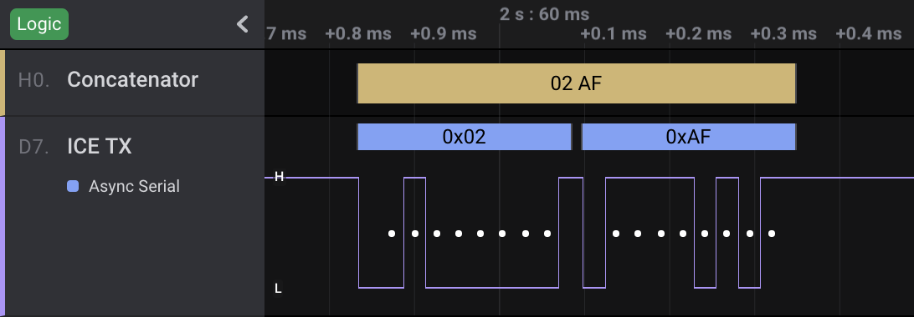

# Concatenator

This HLA combines a stream of bytes into multi-byte messages.

To detect the end of a message and the start of the next one, you can choose
between timeouts or delimiter bytes (or both).
Supported input protocols are I2C, SPI and Serial UART.
Output can be displayed as HEX or ASCII.

This HLA was forked from Mark Garrison's example HLA "Text Messages".

